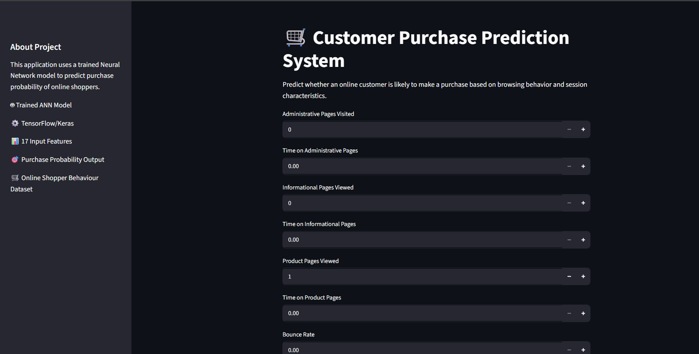
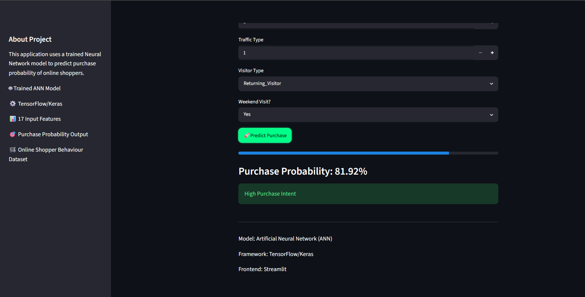
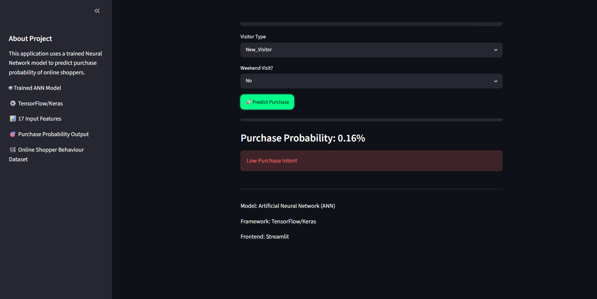

# 🛒 Customer Purchase Prediction System

## 📌 Overview

Customer Purchase Prediction System is a Machine Learning web application that predicts the probability of an online customer making a purchase based on their browsing behavior and session characteristics.

The application uses a trained Artificial Neural Network (ANN) built with TensorFlow/Keras and provides real-time predictions through an interactive Streamlit interface.

---

## 🚀 Features

- Real-time customer purchase prediction
- Artificial Neural Network (ANN) based model
- Interactive Streamlit web interface
- Probability-based purchase intent classification
- Feature scaling using StandardScaler
- Clean and responsive dark-themed UI

---

## 📊 Dataset

This project uses the **Online Shoppers Purchasing Intention Dataset**.

### Input Features

- Administrative
- Administrative Duration
- Informational
- Informational Duration
- Product Related
- Product Related Duration
- Bounce Rates
- Exit Rates
- Page Values
- Special Day
- Month
- Operating Systems
- Browser
- Region
- Traffic Type
- Visitor Type
- Weekend

### Target Variable

- Revenue (Purchase / No Purchase)

---

## 🧠 Model Architecture

The prediction model is built using an Artificial Neural Network (ANN).

```text
Input Layer (17 Features)
        ↓
Dense Layer (32 Neurons, ReLU)
        ↓
Dense Layer (16 Neurons, ReLU)
        ↓
Output Layer (1 Neuron, Sigmoid)
```

The final output is a probability score between 0 and 1 representing the likelihood of a customer making a purchase.

---

## 🛠️ Technologies Used

- Python
- TensorFlow / Keras
- Scikit-Learn
- Pandas
- NumPy
- Streamlit

---

## 📈 Purchase Intent Categories

| Probability | Category |
|------------|----------|
| Below 30% | 🔴 Low Purchase Intent |
| 30% - 70% | 🟡 Moderate Purchase Intent |
| Above 70% | 🟢 High Purchase Intent |

---

## 📷 Application Screenshots

### Home Interface



### High Purchase Intent Prediction



### Low Purchase Intent Prediction



---

## ⚙️ Installation

### Clone the repository

```bash
git clone https://github.com/shivamforge/Customer-Purchase-Prediction.git
```

### Navigate to the project directory

```bash
cd Customer-Purchase-Prediction
```

### Install dependencies

```bash
pip install -r requirements.txt
```

### Run the application

```bash
streamlit run app.py
```

---

## 🎯 Future Improvements

- Deploy application on Streamlit Cloud
- Add model explainability using SHAP
- Compare ANN performance with Random Forest and XGBoost
- Add advanced analytics dashboard
- Improve mobile responsiveness

---

## 👨‍💻 Author

**Shivam**  
National Institute of Technology (NIT) Jalandhar

---

### Project Highlights

✅ Data Preprocessing  
✅ Feature Scaling  
✅ Artificial Neural Network (ANN) Training  
✅ Model Serialization  
✅ Streamlit Deployment  
✅ Real-Time Purchase Prediction

⭐ If you found this project useful, feel free to star the repository.